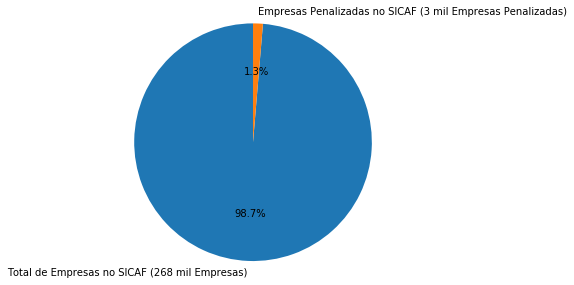
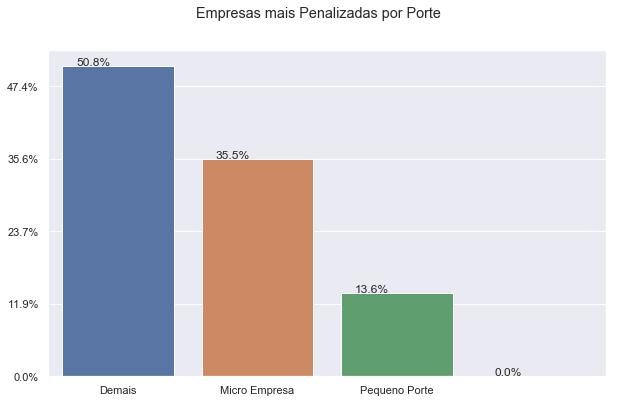
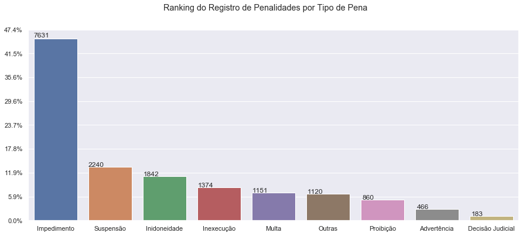
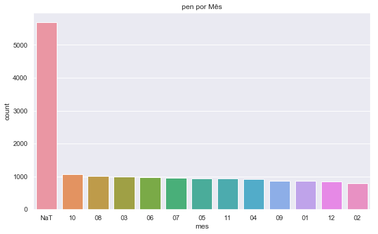
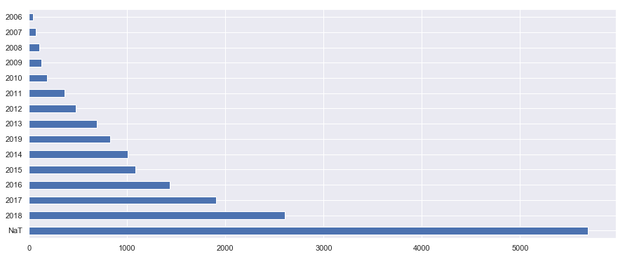
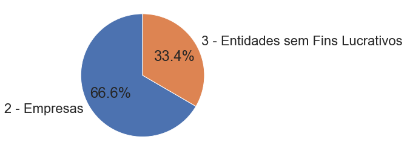

# Análise de Empresas Penalizadas pelo Governo

Vamos realizar uma **análise exploratória** e uma **integração de dados** preliminar para analisar as empresas penalizadas pelo Governo. O objetivo é gerar insights para projetos e trilhas futuras no Governo Federal quanto à compras públicas.

**O que é uma empresa penalizada?** uma empresa contratada pelo Governo pode ser penalizada por vários motivos como irregularidade na prestação de serviços, descumprimento de cláusula contratual, problemas na apresentação de contas, entre outros. Como penalidade, uma empresa pode receber desde uma advertência, multa e até a suspensão e proibição de contratação pelo Governo. Falam muito sobre empresas "SICAFEADAS", aquelas cadastradas na lista negra do SICAF, que não podem mais ter contratos com o Governo porque estão com alguma penalidade ativa. Porém, descobrimos que não existe só o SICAF. Por isso, o primeiro desafio foi o de identificar quem são os órgãos penalizadores e onde estão estas bases de dados. Pra nomenclatura, entendemos como **penalidade** qualquer tipo de **ocorrência** ou **sanção** contra empresas contratadas pelo Governo.

### Origens de Dados
* Ministério da Economia.**SICAF:** http://compras.dados.gov.br/docs/fornecedores/v1/fornecedores.html
* CGU. Cadastro de Entidades sem Fins Lucrativos Impedidas - **CEPIM:** http://www.portaltransparencia.gov.br/download-de-dados/cepim
* CGU. Cadastro de Empresas Inidôneas e Suspensas - **CEIS:** http://www.portaltransparencia.gov.br/download-de-dados/ceis
* CGU. Cadastro Nacional de Empresas Punidas - **CNEP:** http://www.portaltransparencia.gov.br/download-de-dados/cnep
* TCU. Lista de responsáveis declarados inidôneos para participar de licitação na administração pública federal, nos termos do art. 46 da Lei Orgânica do TCU, cuja inidoneidade encontre-se vigente. **INIDONEOS**: https://portal.tcu.gov.br/responsabilizacao-publica/licitantes-inidoneos/
* Governo do RJ. Sancoes do Sistema de Compras Públicas do Estado do Rio de Janeiro RJ. **SANCOES RJ:** http://www.compras.rj.gov.br/Portal-Siga/Sancao/listar.action (listagem de todos de 01/01/2000 a 18/02/2019)
* Governo de MG. Sanções do Estado de Minas Gerais MG. (arquivo extraído ate 18/02/2019) **SANCOES MG:** https://www.cagef.mg.gov.br/fornecedor-web/br/gov/prodemge/seplag/fornecedor/publico/index.zul
* Receita Federal. Cadastro Nacional de Empresas Jurídicas - CNPJ (arquivo de 14 de março de 2019) **EMPRESAS:** http://receita.economia.gov.br/orientacao/tributaria/cadastros/cadastro-nacional-de-pessoas-juridicas-cnpj/dados-publicos-cnpj

### Análise contém:
1. Quantidade de empresas no Brasil segundo a RFB. Empresas penalizadas x Empresas Ativas 
2. Quantidade de empresas no SICAF x Empresas penalizadas no SICAF
3. Ranking das Empresas mais Penalizadas por Porte da Empresa
4. Ranking de registros de penalidades por Origem (Sistema de Penalidades)
5. Quem faz o registro de penalidades no SICAF, também faz no CEIS? 
6. Quais são os órgãos que mais aplicam penalidades;
7. As legislações mais aplicadas em penalidades;
8. Ranking das penalidades mais aplicadas (impedimento, multas, suspensão);
9. Penalidades por mês e ano: Quando acontecem mais penalidades? 
10. Quantidade de penalidades por natureza jurídica;
11. Quais tipos de serviços (CNAE) que sofreram mais penalidades?
12. Top Empresas mais Penalizadas
13. Empresas mais penalizadas por UF
14. Foram dados prazos diferentes para a mesma penalidade?

## 1. Carga dos Dados de Penalidades
Todos os dados usados aqui foram extraídos em CSV dos links citados. Aqui iremos importar estes dados.


```python
# Importa Bibliotecas Python
import pandas as pd
```

### 1.1 SICAF
Ministério da Economia. http://compras.dados.gov.br/docs/fornecedores/v1/fornecedores.html


```python
# 1.1 Carga dos Dados do SICAF
sicaf = pd.read_csv("dados/20190417_SICAF.csv", delimiter='\t', nrows = None, encoding='latin1')

# Cria uma coluna de Data de Inicio e outra de DataFim
sicaf['dataInicio'] = sicaf['dataInicio'] = sicaf['dt_aplicacao'].fillna('') + sicaf['dt_inicial'].fillna('') + sicaf['dt_inicial.1'].fillna('') + sicaf['dt_inicial.2'].fillna('') + sicaf['dt_registro'].fillna('') + sicaf['dt_aplicacao.1'].fillna('') + sicaf['dt_inicial.3'].fillna('')  
sicaf['dataFim'] = sicaf['dt_final'].fillna('') + sicaf['dt_final.1'].fillna('') + sicaf['dt_final.2'].fillna('') + sicaf['dt_final.3'].fillna('')

# Deleta colunas de data excedentes
sicaf = sicaf.drop(['dt_aplicacao', 'dt_inicial', 'dt_inicial.1', 
                    'dt_inicial.2', 'dt_registro', 'dt_aplicacao.1', 'dt_inicial.3', 
                    'dt_final', 'dt_final.1', 'dt_final.2', 'dt_final.3'], axis=1)

# Altera o nome das colunas
sicaf.columns = ['cnpj', 'nome', 'penalidade', 'sancionador', 'motivo', 'dataInicio', 'dataFim']

# Adiciona uma nova coluna para identificar a origem de dados
sicaf['origem'] = 'SICAF'

# Imprime as dimensões e as primeiras linhas
nRow, nCol = sicaf.shape
print(f'There are {nRow} rows and {nCol} columns')
sicaf.head(5)

# Formata a data
import datetime

# Altera o tipo do campo para datetime
sicaf['dataInicio']=pd.to_datetime(sicaf['dataInicio'], format="%Y-%m-%d", errors='coerce')
sicaf.head()

# Muda o formato da data para dd/mm/yyyy
sicaf['dataInicio']= sicaf['dataInicio'].dt.strftime('%d/%m/%Y')
sicaf.head();
```

    There are 3572 rows and 8 columns
    


```python
sicaf.info()
```

    <class 'pandas.core.frame.DataFrame'>
    RangeIndex: 3572 entries, 0 to 3571
    Data columns (total 8 columns):
    cnpj           3572 non-null int64
    nome           3572 non-null object
    penalidade     3572 non-null object
    sancionador    3572 non-null object
    motivo         3572 non-null object
    dataInicio     3572 non-null object
    dataFim        3572 non-null object
    origem         3572 non-null object
    dtypes: int64(1), object(7)
    memory usage: 223.3+ KB
    

### 1.2 CEPIM
CGU. Cadastro de Entidades sem Fins Lucrativos Impedidas. Extraído ate 15/04/2019. CEPIM: http://www.portaltransparencia.gov.br/download-de-dados/cepim


```python
# 1.2 Carga dos Dados do CEPIM
cepim = pd.read_csv("dados/20190415_CEPIM.csv", delimiter=';', nrows = None, encoding='latin1')

# Adiciona uma nova coluna para identificar a origem de dados
cepim['origemDados'] = 'CEPIM'
cepim['Tipo'] = 'Impedimento'

# Deleta colunas
cepim = cepim.drop(['NÚMERO CONVÊNIO'], axis=1)

# Altera o nome das colunas
cepim.columns = ['cnpj', 'nome', 'sancionador', 'motivo', 'origem', 'penalidade']

# Cria colunas que não existem com valores vazios
cepim['dataInicio'] = ''
cepim['dataFim'] = ''

# Muda a ordem das colunas
cepim = cepim[['cnpj', 'nome','penalidade','sancionador','motivo','dataInicio','dataFim','origem']]

# Imprime as dimensões e as primeiras linhas
nRow, nCol = cepim.shape
print(f'There are {nRow} rows and {nCol} columns')
cepim.head(5);
```

    There are 5570 rows and 8 columns
    

### 1.3 CEIS
CGU. Cadastro de Empresas Inidôneas e Suspensas - CEIS. Extraído até 16/04/2019. Link: http://www.portaltransparencia.gov.br/download-de-dados/ceis


```python
# 1.3 Carga dos Dados do CEIS
ceis = pd.read_csv("dados/20190416_CEIS.csv", delimiter=';', nrows = None, encoding='latin1')

# Adiciona uma nova coluna para identificar a origem de dados
ceis['OrigemDados'] = 'CEIS'

# Deleta colunas
ceis = ceis.drop(['TIPO DE PESSOA', 'RAZÃO SOCIAL - CADASTRO RECEITA', 
                    'NOME FANTASIA - CADASTRO RECEITA', 
                    'NÚMERO DO PROCESSO',
                    'UF ÓRGÃO SANCIONADOR',
                    'ORIGEM INFORMAÇÕES',
                    'DATA ORIGEM INFORMAÇÕES',
                    'DATA PUBLICAÇÃO',
                    'PUBLICAÇÃO',
                    'DETALHAMENTO',
                    'ABRAGÊNCIA DEFINIDA EM DECISÃO JUDICIAL',
                    'DESCRIÇÃO DA FUNDAMENTAÇÃO LEGAL',
                    'DATA DO TRÂNSITO EM JULGADO',
                    'COMPLEMENTO DO ÓRGÃO',
                    'OBSERVAÇÕES'], axis=1)

# Altera o nome das colunas
ceis.columns = ['cnpj', 'nome', 'penalidade', 'dataInicio', 'dataFim', 'sancionador', 'motivo', 'origem']

# Muda a ordem das colunas
ceis = ceis[['cnpj', 'nome','penalidade','sancionador','motivo','dataInicio','dataFim','origem']]

# Imprime as dimensões e as primeiras linhas
nRow, nCol = ceis.shape
print(f'There are {nRow} rows and {nCol} columns')
ceis.head(5);
```

    There are 12640 rows and 8 columns
    

### 1.4 CNEP
CGU. Cadastro Nacional de Empresas Punidas - CNEP. Extraído até 16/04/2019. Link: http://www.portaltransparencia.gov.br/download-de-dados/cnep


```python
# 1.4 Carga dos Dados do CNEP
cnep = pd.read_csv('dados/20190416_CNEP.csv', delimiter=';', nrows = None, encoding='latin1')

# Adiciona uma nova coluna para identificar a origem de dados
cnep['OrigemDados'] = 'CNEP'

# Deleta colunas
cnep = cnep.drop(['TIPO DE PESSOA', 
                  'RAZÃO SOCIAL – CADASTRO RECEITA', 
                  'NOME FANTASIA – CADASTRO RECEITA',
                    'NÚMERO DO PROCESSO',
                    'UF ÓRGÃO SANCIONADOR',
                    'ORIGEM INFORMAÇÕES',
                    'DATA ORIGEM INFORMAÇÕES',
                    'DATA PUBLICAÇÃO',
                    'PUBLICAÇÃO',
                    'DETALHAMENTO',
                    'VALOR DA MULTA',
                    'DESCRIÇÃO DA FUNDAMENTAÇÃO LEGAL',
                    'DATA DO TRÂNSITO EM JULGADO',
                    'COMPLEMENTO DO ÓRGÃO'], axis=1)

# Altera o nome das colunas
cnep.columns = ['cnpj', 'nome', 'penalidade', 'dataInicio', 'dataFim', 'sancionador', 'motivo', 'origem']

# Muda a ordem das colunas
cnep = cnep[['cnpj', 'nome', 'penalidade', 'sancionador','motivo','dataInicio','dataFim','origem']]

# Imprime as dimensões e as primeiras linhas
nRow, nCol = cnep.shape
print(f'There are {nRow} rows and {nCol} columns')
cnep.head(5);
```

    There are 101 rows and 8 columns
    

### 1.5 INIDONEOS
TCU. Lista de responsáveis declarados inidôneos para participar de licitação na administração pública federal, nos termos do art. 46 da Lei Orgânica do TCU, cuja inidoneidade encontre-se vigente. INIDONEOS:  https://contas.tcu.gov.br/ords/f?p=1660:2:0:CSV:::: 


```python
# 1.5 Carga dos Dados de INIDONEOS
inidoneo = pd.read_csv('dados/20190416_INIDONEO.csv', delimiter=';', nrows = None, encoding='latin1')

# Adiciona uma nova coluna para identificar a origem de dados
inidoneo['OrigemDados'] = 'INIDONEO'
inidoneo['Tipo'] = 'Inidoneo'

# Deleta colunas
inidoneo = inidoneo.drop(['Deliberação', 'Processo', 'UF'], axis=1)

# Altera o nome das colunas
inidoneo.columns = ['nome', 'cnpj', 'dataInicio', 'dataFim', 'origem', 'penalidade']

# Cria colunas faltantes
inidoneo['sancionador'] = 'TCU'
inidoneo['motivo'] = ''

# Muda a ordem das colunas
inidoneo = inidoneo[['cnpj', 'nome', 'penalidade', 'sancionador','motivo','dataInicio','dataFim','origem']]

# Imprime as dimensões e as primeiras linhas
nRow, nCol = inidoneo.shape
print(f'There are {nRow} rows and {nCol} columns')
inidoneo.head(5);
```

    There are 183 rows and 8 columns
    

### 1.6 SANCOES RJ
Governo do RJ. Sancoes do Sistema de Compras Públicas do Estado do Rio de Janeiro RJ. SANCOES RJ: http://www.compras.rj.gov.br/Portal-Siga/Sancao/listar.action (listagem de todos de 01/01/2000 a 18/02/2019)


```python
# Carga dos Dados de Sancoes do RJ
sancoesrj = pd.read_excel('dados/20190416_SancoesRJ.xls')

# Adiciona uma nova coluna para identificar a origem de dados 
sancoesrj['OrigemDados'] = 'SANCOES RJ'

# Deleta colunas
sancoesrj = sancoesrj.drop(['Número do processo', 'Prazo', 'Data Início', 'Justificativa', 'Motivo'], axis=1)

# Altera o nome das colunas
sancoesrj.columns = ['nome', 'cnpj', 'motivo', 'dataInicio', 'dataFim', 'sancionador', 'penalidade', 'origem']

# Muda a ordem das colunas
sancoesrj = sancoesrj[['cnpj', 'nome','penalidade','sancionador','motivo','dataInicio','dataFim','origem']]

# Imprime as dimensões e as primeiras linhas
nRow, nCol = sancoesrj.shape
print(f'There are {nRow} rows and {nCol} columns')
sancoesrj.head(5);
```

    There are 896 rows and 8 columns
    

### 1.7 SANCOES MG
Governo de MG. Sanções do Estado de Minas Gerais MG. (arquivo extraído ate 18/02/2019) SANCOES MG: https://www.cagef.mg.gov.br/fornecedor-web/br/gov/prodemge/seplag/fornecedor/publico/index.zul


```python
# Carga dos Dados de Sancoes de MG
sancoesmg = pd.read_csv('dados/20190218_SancoesMG.csv', delimiter=';', nrows = None, encoding='utf-8')

# Adiciona uma nova coluna para identificar a origem de dados 
sancoesmg['OrigemDados'] = 'SANCOES MG'

# Deleta colunas
sancoesmg = sancoesmg.drop(['Data da Publicação do Despacho'], axis=1)

# Cria colunas faltantes
sancoesmg['motivo'] = ''

# Altera o nome das colunas
sancoesmg.columns = ['cnpj', 'nome', 'penalidade', 'dataInicio', 'dataFim', 'sancionador','origem', 'motivo']

# Muda a ordem das colunas
sancoesmg = sancoesmg[['cnpj', 'nome','penalidade','sancionador','motivo','dataInicio','dataFim','origem']]

# Imprime as dimensões e as primeiras linhas
nRow, nCol = sancoesmg.shape
print(f'There are {nRow} rows and {nCol} columns')
sancoesmg.head(5);
```

    There are 348 rows and 8 columns
    

## 2. Integração dos dados de Penalidades
Vamos integrar os dados num dataset único num formato mais simples e padronizado. FORMATO:
* cnpj
* nomeEmpresa
* tipo
* sancionador
* motivo
* dataInicio
* dataFim
* origem


```python
# Junção dos dados de penalidades por CNPJ ou CPF
penalidades = pd.concat([sicaf, cepim, ceis, cnep, inidoneo, sancoesrj, sancoesmg])
```


```python
# retirar pontos e traços dos numeros do cnpj de penalidades
penalidades['cnpj'].replace(regex=True,inplace=True,to_replace=r'\D',value=r'')
```


```python
# Transforma para str
import numpy as np
penalidades['cnpj'] = penalidades.cnpj.astype(str)

# Remove os zeros antes do numero do CNPJ
penalidades['cnpj'] = penalidades.cnpj.str.lstrip("0")

# Transforma para int64
penalidades['cnpj'] = penalidades.cnpj.astype(np.int64)
```


```python
# Verifica se tem algum que o CNPJ é nulo
len(penalidades[penalidades['cnpj'].isnull()])
```


    0


```python
# Imprime as dimensões e as primeiras linhas
nRow, nCol = penalidades.shape
print(f'There are {nRow} rows and {nCol} columns')
penalidades.tail();
```

    There are 23310 rows and 8 columns
    


```python
# Salva o dataset de penalidades separado por TAB
penalidades.to_csv('dados/penalidades.csv', sep = '\t', index=False)
```

## 3. Integração de Penalidades com dados das Empresas (vide RECEITA FEDERAL)
Receita Federal. Cadastro Nacional de Empresas Jurídicas - CNPJ (arquivo de 14 de março de 2019). Este arquivo não contém penalidades, mas contém todas as empresas cadastradas na Receita Federal. 

EMPRESAS: http://receita.economia.gov.br/orientacao/tributaria/cadastros/cadastro-nacional-de-pessoas-juridicas-cnpj/dados-publicos-cnpj

Adicionaremos os dados da Receita Federal de: situacao_cadastral, porte, data_inicio_atividade, uf, codigo_natureza_juridica


```python
# 1.1 Carga dos Dados do CNPJ da Receita Federal
import pandas as pd
cnpj = pd.read_csv('dados/cnpj_dados_cadastrais_pj.csv', sep='#',
                   usecols=['cnpj', 'razao_social', 'cnae_fiscal', 'uf', 'porte_empresa', 
                            'data_inicio_atividade', 'codigo_natureza_juridica', 'situacao_cadastral'])

# Quantidade de Empresas: 40 milhões
cnpj.shape
```


    (40184161, 8)


```python
# Porque mais de 7 mil nao sao encontrados? Ajusta tipos de dados
import numpy as np
#dtype = dict(cnpj=np.int64)
#pen = penalidades.astype(dtype).merge(cnpj.astype(dtype), 'left')
#pen.tail()
```


```python
# Integra os dados de penalidades e de cnpj (receita federal)
pen = pd.merge(penalidades, cnpj, on='cnpj', how='left')
```


```python
# Valores Nulos
pen.isna().sum();
```


```python
# Filtra onde tem NA
pen[pen['razao_social'].isnull()].head();
```


```python
# Confere se todos nulos são pessoa fisica
pen2 = pen[pen['razao_social'].isnull()].head()

# Retorna a qtd de caracteres da maior string de cnpj
pen2['cnpj'] = pen2.cnpj.astype(str)
pen2.cnpj.str.len().max();
```


```python
# Remove os CPFs, sao as penalidades onde o CNPJ tem 11 digitos (é um CPF) e nao foi encontrado no CNPJ
pen = pen.dropna(subset=['razao_social'])
pen.shape;
```


```python
# Valores Nulos
pen.isna().sum();
```


```python
pen.info()
```

    <class 'pandas.core.frame.DataFrame'>
    Int64Index: 16867 entries, 0 to 23304
    Data columns (total 15 columns):
    cnpj                        16867 non-null int64
    nome                        16867 non-null object
    penalidade                  16867 non-null object
    sancionador                 16025 non-null object
    motivo                      16867 non-null object
    dataInicio                  16867 non-null object
    dataFim                     14865 non-null object
    origem                      16867 non-null object
    razao_social                16867 non-null object
    situacao_cadastral          16867 non-null float64
    codigo_natureza_juridica    16867 non-null float64
    data_inicio_atividade       16867 non-null object
    cnae_fiscal                 16867 non-null float64
    uf                          16867 non-null object
    porte_empresa               16867 non-null float64
    dtypes: float64(4), int64(1), object(10)
    memory usage: 2.1+ MB
    


```python
# Salva o dataset de penalidades separado por TAB
pen.to_csv('dados/pen.csv', sep = '\t', index=False)
```

## Integração com a descrição do CNAE


```python
import pandas as pd
cnae = pd.read_csv('dados/cnae_201905141833.csv', sep=';')
cnae.head()
```


<div>
<style scoped>
    .dataframe tbody tr th:only-of-type {
        vertical-align: middle;
    }

    .dataframe tbody tr th {
        vertical-align: top;
    }

    .dataframe thead th {
        text-align: right;
    }
</style>
<table border="1" class="dataframe">
  <thead>
    <tr style="text-align: right;">
      <th></th>
      <th>id_cnae</th>
      <th>dsc_cnae</th>
      <th>cod_cnae_longo</th>
    </tr>
  </thead>
  <tbody>
    <tr>
      <th>0</th>
      <td>111301</td>
      <td>CULTIVO DE ARROZ</td>
      <td>0111-3/01</td>
    </tr>
    <tr>
      <th>1</th>
      <td>111302</td>
      <td>CULTIVO DE MILHO</td>
      <td>0111-3/02</td>
    </tr>
    <tr>
      <th>2</th>
      <td>111303</td>
      <td>CULTIVO DE TRIGO</td>
      <td>0111-3/03</td>
    </tr>
    <tr>
      <th>3</th>
      <td>111399</td>
      <td>CULTIVO DE OUTROS CEREAIS NÃO ESPECIFICADOS AN...</td>
      <td>0111-3/99</td>
    </tr>
    <tr>
      <th>4</th>
      <td>112101</td>
      <td>CULTIVO DE ALGODÃO HERBÁCEO</td>
      <td>0112-1/01</td>
    </tr>
  </tbody>
</table>
</div>


```python
pen['id_cnae'] = pd.to_numeric(pen.cnae_fiscal, downcast='integer')
```


```python
pen = pd.merge(pen, cnae)
```


```python
pen.drop(['cod_cnae_longo', 'id_cnae', 'cnae_fiscal'], 1, inplace=True)
pen.head()
```


<div>
<style scoped>
    .dataframe tbody tr th:only-of-type {
        vertical-align: middle;
    }

    .dataframe tbody tr th {
        vertical-align: top;
    }

    .dataframe thead th {
        text-align: right;
    }
</style>
<table border="1" class="dataframe">
  <thead>
    <tr style="text-align: right;">
      <th></th>
      <th>cnpj</th>
      <th>nome</th>
      <th>penalidade</th>
      <th>sancionador</th>
      <th>motivo</th>
      <th>dataInicio</th>
      <th>dataFim</th>
      <th>origem</th>
      <th>razao_social</th>
      <th>situacao_cadastral</th>
      <th>codigo_natureza_juridica</th>
      <th>data_inicio_atividade</th>
      <th>uf</th>
      <th>porte_empresa</th>
      <th>dsc_cnae</th>
    </tr>
  </thead>
  <tbody>
    <tr>
      <th>0</th>
      <td>2216853000190</td>
      <td>FERNANDO ABDALA ADVOGADOS &amp; ASSOCIADOS S/C LTDA</td>
      <td>Multa prevista Cláusula 17ª, Item 17.1.6, Cont...</td>
      <td>MINISTERIO DO PLANEJAMENTO,DESENV. E GESTÃO</td>
      <td>ATENDENDO DETERMINACAO CONTIDA NO OFICIO 158/2...</td>
      <td>09/10/2008</td>
      <td></td>
      <td>SICAF</td>
      <td>FERNANDO ABDALA ADVOGADOS &amp; ASSOCIADOS S/C LTDA</td>
      <td>2.0</td>
      <td>2062.0</td>
      <td>1997-10-22</td>
      <td>RJ</td>
      <td>3.0</td>
      <td>SERVIÇOS ADVOCATÍCIOS</td>
    </tr>
    <tr>
      <th>1</th>
      <td>2216853000190</td>
      <td>FERNANDO ABDALA ADVOGADOS &amp; ASSOCIADOS S/C LTDA</td>
      <td>inexecução parcial da Nota de Empenho 2017NE04315</td>
      <td>MINISTERIO DO PLANEJAMENTO,DESENV. E GESTÃO</td>
      <td>ATENDENDO DETERMINACAO CONTIDA NO OFICIO 210/2...</td>
      <td>06/08/2008</td>
      <td>2013-08-06</td>
      <td>SICAF</td>
      <td>FERNANDO ABDALA ADVOGADOS &amp; ASSOCIADOS S/C LTDA</td>
      <td>2.0</td>
      <td>2062.0</td>
      <td>1997-10-22</td>
      <td>RJ</td>
      <td>3.0</td>
      <td>SERVIÇOS ADVOCATÍCIOS</td>
    </tr>
    <tr>
      <th>2</th>
      <td>1119125000106</td>
      <td>BARBOUR SILVA E ADVOGADOS ASSOCIADOS S/C</td>
      <td>inexecução parcial da Nota de Empenho 2017NE04315</td>
      <td>MINISTERIO DO PLANEJAMENTO,DESENV. E GESTÃO</td>
      <td>Proibido de contratar com o poder público ou r...</td>
      <td>30/10/2008</td>
      <td>2011-10-30</td>
      <td>SICAF</td>
      <td>BARBOUR SILVA E ADVOGADOS ASSOCIADOS S/C</td>
      <td>8.0</td>
      <td>2240.0</td>
      <td>1995-09-18</td>
      <td>SP</td>
      <td>5.0</td>
      <td>SERVIÇOS ADVOCATÍCIOS</td>
    </tr>
    <tr>
      <th>3</th>
      <td>2702073000150</td>
      <td>MOURAO E ASSOCIADOS</td>
      <td>Conforme inciso X. art.6º do Decreto Estadual ...</td>
      <td>JUSTICA ELEITORAL</td>
      <td>Aplicação da sanção de proibição de participar...</td>
      <td>29/11/2011</td>
      <td>2016-11-28</td>
      <td>SICAF</td>
      <td>MOURAO E ASSOCIADOS</td>
      <td>2.0</td>
      <td>2232.0</td>
      <td>1996-05-14</td>
      <td>MG</td>
      <td>3.0</td>
      <td>SERVIÇOS ADVOCATÍCIOS</td>
    </tr>
    <tr>
      <th>4</th>
      <td>2338563000110</td>
      <td>VANESSA RIBEIRO ADVOGADOS - ME</td>
      <td>Suspensão temporária e Impedimento de contrata...</td>
      <td>BANCO DO NORDESTE DO BRASIL</td>
      <td>O contratado não satisfez as condições necessá...</td>
      <td>10/12/2012</td>
      <td>2014-12-09</td>
      <td>SICAF</td>
      <td>VANESSA RIBEIRO ADVOGADOS</td>
      <td>4.0</td>
      <td>2232.0</td>
      <td>1998-01-27</td>
      <td>PB</td>
      <td>5.0</td>
      <td>SERVIÇOS ADVOCATÍCIOS</td>
    </tr>
  </tbody>
</table>
</div>


# 3. Análise Exploratória
1. Quantidade de empresas no Brasil segundo a RFB. Empresas penalizadas x Empresas Ativas 
2. Quantidade de empresas no SICAF x Empresas penalizadas no SICAF
3. Ranking das Empresas mais Penalizadas por Porte da Empresa
4. Ranking de registros de penalidades por Origem (Sistema de Penalidades)
5. Quem faz o registro de penalidades no SICAF, também faz no CEIS? 
6. Quais são os órgãos que mais aplicam penalidades;
7. As legislações mais aplicadas em penalidades;
8. Ranking das penalidades mais aplicadas (impedimento, multas, suspensão);
9. Penalidades por mês e ano: Quando acontecem mais penalidades? 
10. Quantidade de penalidades por natureza jurídica;
11. Quais tipos de serviços (CNAE) que sofreram mais penalidades?
12. Top Empresas mais Penalizadas
13. Empresas mais penalizadas por UF
14. Foram dados prazos diferentes para a mesma penalidade?


```python
import seaborn as sns
from matplotlib.pyplot import suptitle
import matplotlib.pyplot as plt
```

## 1. Quantidade de empresas no Brasil e Proporção de Penalidades

#### Status da Empresa - Situação Cadastral
* 2 - ATIVA    (18 milhões de empresas ativas)
* 8 - BAIXADA
* 4 - INAPTA
* 3 - SUSPENSA
* 1 - NULA


```python
cnpj.situacao_cadastral.value_counts()
```


    2    18240895
    8    18124506
    4     3574947
    3      167790
    1       76023
    Name: situacao_cadastral, dtype: int64


#### Proporção de Empresas Penalizadas pelo Total de Empresas na RFB


```python
# Quantidade de CNPJs únicos totais penalizados
len(pen.cnpj.unique())
```


    10042


```python
# Quantidade total de CNPJs
len(cnpj.cnpj.unique())
```


    40184161


```python
# Percentual de empresas penalisadas de acordo com a qtd total de empresas: 3%
(len(pen.cnpj.unique()) * 100) / len(cnpj.cnpj.unique())
```


    0.024989945665407822


```python
# Percentual de empresas penalisadas de acordo com a qtd de empresas ativas na RFB: 8%
(len(pen.cnpj.unique()) * 100) / len(cnpj.loc[cnpj['situacao_cadastral'] == 2])
```


    0.05505212326478498


```python
# Total de empresas ativas na RFB - total de empresas penalizadas nos sistemas analisados
18240895-10002
```


    18230893


```python
labels = ['Total de Empresas Ativas na RFB (18 milhões de Empresas)', 
          'Empresas Penalizadas em todos os Sistemas Analisados (10 mil Empresas Penalizadas)']
sizes = [18230893,10042]
fig1, ax1 = plt.subplots()
ax1.pie(sizes, labels=labels, autopct='%1.1f%%', startangle=90)
ax1.axis('equal')  
plt.tight_layout()
plt.show()
```


## 2. Quantidade de empresas no SICAF x Empresas penalizadas no SICAF


```python
# Percentual de empresas penalisadas no SICAF de acordo com a qtd de empresas ativas na RFB: 
(len(pen.loc[pen['origem'] == 'SICAF'])) / len(cnpj.loc[cnpj['situacao_cadastral'] == 2])
```


    0.0001958237246582473


```python
# Percentual de empresas penalisadas no SICAF de acordo com a qtd de empresas no SICAF: 
# Quantidade de empresas (pessoa jurídica) no SICAF: 268.302
total_empresas_sicaf = 268302
(len(pen.loc[pen['origem'] == 'SICAF'])) / total_empresas_sicaf
```


    0.013313355845278827


```python
# Total de empresas no SICAF - empresas penalizadas no SICAF
268302 - 3572
```


    264730


```python
labels = ['Total de Empresas no SICAF (268 mil Empresas)', 'Empresas Penalizadas no SICAF (3 mil Empresas Penalizadas)']
sizes = [264730,3572]
fig1, ax1 = plt.subplots()
ax1.pie(sizes, labels=labels, autopct='%1.1f%%', startangle=90)
ax1.axis('equal')  
plt.tight_layout()
plt.show()
```





## 3. Penalidades por Porte da Empresa
* 01 - MICRO EMPRESA
* 05 - DEMAIS
* 03 - EMPRESA DE PEQUENO PORTE
* 00 - NAO INFORMADO


```python
cnpj.porte_empresa.value_counts()
```


    1.0    25011688
    5.0    13960818
    3.0     1160731
    0.0       50921
    Name: porte_empresa, dtype: int64


```python
pen.porte_empresa.value_counts();
```


```python
# Penalidades por Porte
pd.concat([pen.porte_empresa.value_counts(), 
                pen.porte_empresa.value_counts(normalize=True).mul(100)],axis=1, keys=('counts','percentage'));
```


```python
descending_order = pen.porte_empresa.value_counts().sort_values(ascending=False).index

plt.figure(figsize=(10, 6));
sns.set(style="darkgrid")
suptitle("Empresas mais Penalizadas por Porte")
ax = sns.countplot(x="porte_empresa", data=pen, order=descending_order)
ax.set_xticklabels(["Demais","Micro Empresa","Pequeno Porte"])
ax.set_xlabel("") # Titulo do Eixo X
ax.set_ylabel("") # Titulo do Eixo Y

total = len(pen)*1.
for p in ax.patches:
        ax.annotate('{:.1f}%'.format(100*p.get_height()/total), (p.get_x()+0.1, p.get_height()+5))

#put 11 ticks (therefore 10 steps), from 0 to the total number of rows in the dataframe
#ax.yaxis.set_ticks(np.linspace(0, total, 11))

#adjust the ticklabel to the desired format, without changing the position of the ticks. 
_ = ax.set_yticklabels(map('{:.1f}%'.format, 100*ax.yaxis.get_majorticklocs()/total))
```





## 4. Ranking de registros de penalidades por Origem (Sistema de Penalidades)


```python
# 1. Penalidades por Origem
descending_order = pen.origem.value_counts().sort_values(ascending=False).index

plt.figure(figsize=(22, 8));
#sns.set(style="darkgrid")
suptitle("Ranking do Registro de Penalidades por Origem")
ax = sns.countplot(x="origem", data=pen, order=descending_order)
#ax.set_xticklabels(["Demais","Micro Empresa","Pequeno Porte"])
ax.set_xlabel("") # Titulo do Eixo X
ax.set_ylabel("") # Titulo do Eixo Y

total = len(pen)*1.
#for p in ax.patches:
#    ax.annotate('{:.1f}%'.format(100*p.get_height()/total), (p.get_x()+0.1, p.get_height()+5), ha="right")
        
for p in ax.patches:
    ax.annotate(str(p.get_height()), (p.get_x() * 1.005, p.get_height() * 1.005))

#put 11 ticks (therefore 10 steps), from 0 to the total number of rows in the dataframe
#ax.yaxis.set_ticks(np.linspace(0, total, 11))

#adjust the ticklabel to the desired format, without changing the position of the ticks. 
_ = ax.set_yticklabels(map('{:.1f}%'.format, 100*ax.yaxis.get_majorticklocs()/total))
```


## 5. Quem faz o registro de penalidades no SICAF, também faz no CEIS ou CEPIM?
Os registros de penalidades são feitos em mais de um sistema? 
* CEIS - Cadastro de Empresas Inidoneas e Suspensas
* CEPIM - Cadastr de Entidades Privadas Sem Fins Lucrativos Impedidas


```python
# Filtra penalidades de empresas que tiveram mais de uma origem (sistema de cadastro de penalidades)
pen.groupby('cnpj')['origem'].nunique().sort_values(ascending=False).head()
```


    cnpj
    30834196000180    4
    531541000146      3
    62277207000165    3
    8599961000176     3
    5667996000107     3
    Name: origem, dtype: int64


```python
# Registro nos 3 sistemas. Empresa. SICAF - CEIS - INIDONEO
pen.loc[pen['cnpj'] == 5667996000107]
```


<div>
<style scoped>
    .dataframe tbody tr th:only-of-type {
        vertical-align: middle;
    }

    .dataframe tbody tr th {
        vertical-align: top;
    }

    .dataframe thead th {
        text-align: right;
    }
</style>
<table border="1" class="dataframe">
  <thead>
    <tr style="text-align: right;">
      <th></th>
      <th>cnpj</th>
      <th>nome</th>
      <th>penalidade</th>
      <th>sancionador</th>
      <th>motivo</th>
      <th>dataInicio</th>
      <th>dataFim</th>
      <th>origem</th>
      <th>razao_social</th>
      <th>situacao_cadastral</th>
      <th>codigo_natureza_juridica</th>
      <th>data_inicio_atividade</th>
      <th>uf</th>
      <th>porte_empresa</th>
      <th>dsc_cnae</th>
    </tr>
  </thead>
  <tbody>
    <tr>
      <th>2740</th>
      <td>5667996000107</td>
      <td>RG COMERCIAL E CONSTRUTORA E TERRAPLANAGEM LTD...</td>
      <td>inexecução parcial da Nota de Empenho 2017NE04315</td>
      <td>TRIBUNAL DE CONTAS DA UNIAO</td>
      <td>Declarada inidônea, com fundamento no art. 46 ...</td>
      <td>04/09/2015</td>
      <td>2020-09-03</td>
      <td>SICAF</td>
      <td>RG COMERCIAL E CONSTRUTORA E TERRAPLANAGEM LTDA</td>
      <td>2.0</td>
      <td>2062.0</td>
      <td>2003-05-28</td>
      <td>TO</td>
      <td>3.0</td>
      <td>COMÉRCIO VAREJISTA DE MATERIAIS DE CONSTRUÇÃO ...</td>
    </tr>
    <tr>
      <th>2768</th>
      <td>5667996000107</td>
      <td>RG COM E CONSTR. E TERRAPLANAGEM LTDA. ME</td>
      <td>Inidoneidade - Lei Orgânica TCU</td>
      <td>TRIBUNAL DE CONTAS DA UNIÃO</td>
      <td>Art. 46, Lei 8443/1992</td>
      <td>04/09/2015</td>
      <td>04/09/2020</td>
      <td>CEIS</td>
      <td>RG COMERCIAL E CONSTRUTORA E TERRAPLANAGEM LTDA</td>
      <td>2.0</td>
      <td>2062.0</td>
      <td>2003-05-28</td>
      <td>TO</td>
      <td>3.0</td>
      <td>COMÉRCIO VAREJISTA DE MATERIAIS DE CONSTRUÇÃO ...</td>
    </tr>
    <tr>
      <th>2846</th>
      <td>5667996000107</td>
      <td>RG CONSTRUTORA/RG COMERCIAL E CONSTRUTORA E TE...</td>
      <td>Inidoneo</td>
      <td>TCU</td>
      <td></td>
      <td>04/09/2015</td>
      <td>04/09/2020</td>
      <td>INIDONEO</td>
      <td>RG COMERCIAL E CONSTRUTORA E TERRAPLANAGEM LTDA</td>
      <td>2.0</td>
      <td>2062.0</td>
      <td>2003-05-28</td>
      <td>TO</td>
      <td>3.0</td>
      <td>COMÉRCIO VAREJISTA DE MATERIAIS DE CONSTRUÇÃO ...</td>
    </tr>
  </tbody>
</table>
</div>


```python
# Registro nos 3 sistemas. ASSOCIACAO. SICAF - CEPIM - INIDONEO
pen.loc[pen['cnpj'] == 37114485000154 ]
```


<div>
<style scoped>
    .dataframe tbody tr th:only-of-type {
        vertical-align: middle;
    }

    .dataframe tbody tr th {
        vertical-align: top;
    }

    .dataframe thead th {
        text-align: right;
    }
</style>
<table border="1" class="dataframe">
  <thead>
    <tr style="text-align: right;">
      <th></th>
      <th>cnpj</th>
      <th>nome</th>
      <th>penalidade</th>
      <th>sancionador</th>
      <th>motivo</th>
      <th>dataInicio</th>
      <th>dataFim</th>
      <th>origem</th>
      <th>razao_social</th>
      <th>situacao_cadastral</th>
      <th>codigo_natureza_juridica</th>
      <th>data_inicio_atividade</th>
      <th>uf</th>
      <th>porte_empresa</th>
      <th>dsc_cnae</th>
    </tr>
  </thead>
  <tbody>
    <tr>
      <th>9071</th>
      <td>37114485000154</td>
      <td>ASSOCIACAO BRASILEIRA DE EDUCACAO AGRICOLA SUP...</td>
      <td>inexecução parcial da Nota de Empenho 2017NE04315</td>
      <td>TRIBUNAL DE CONTAS DA UNIAO</td>
      <td>Declarar, com fundamento no art. 46 da Lei 8.4...</td>
      <td>06/02/2018</td>
      <td>2023-02-05</td>
      <td>SICAF</td>
      <td>ASSOCIACAO BRASILEIRA DE EDUCACAO AGRICOLA SUP...</td>
      <td>4.0</td>
      <td>3999.0</td>
      <td>1992-03-05</td>
      <td>DF</td>
      <td>5.0</td>
      <td>ATIVIDADES DE ASSOCIAÇÕES DE DEFESA DE DIREITO...</td>
    </tr>
    <tr>
      <th>11901</th>
      <td>37114485000154</td>
      <td>ASSOCIACAO BRASILEIRA DE EDUCACAO AGRICOLA SUP...</td>
      <td>Impedimento</td>
      <td>Ministério da Agricultura, Pecuária e Abasteci...</td>
      <td>IRREGULARIDADE NA EXECUCAO FIS. E FINANCEIRA</td>
      <td></td>
      <td></td>
      <td>CEPIM</td>
      <td>ASSOCIACAO BRASILEIRA DE EDUCACAO AGRICOLA SUP...</td>
      <td>4.0</td>
      <td>3999.0</td>
      <td>1992-03-05</td>
      <td>DF</td>
      <td>5.0</td>
      <td>ATIVIDADES DE ASSOCIAÇÕES DE DEFESA DE DIREITO...</td>
    </tr>
    <tr>
      <th>12700</th>
      <td>37114485000154</td>
      <td>ABEAS/ASSOCIACAO BRASILEIRA DE EDUCACAO AGRICO...</td>
      <td>Inidoneo</td>
      <td>TCU</td>
      <td></td>
      <td>06/02/2018</td>
      <td>06/02/2023</td>
      <td>INIDONEO</td>
      <td>ASSOCIACAO BRASILEIRA DE EDUCACAO AGRICOLA SUP...</td>
      <td>4.0</td>
      <td>3999.0</td>
      <td>1992-03-05</td>
      <td>DF</td>
      <td>5.0</td>
      <td>ATIVIDADES DE ASSOCIAÇÕES DE DEFESA DE DIREITO...</td>
    </tr>
  </tbody>
</table>
</div>


```python
# Registro tanto no CEIS quanto no CEPIM. Não há no SICAF.
pen.loc[pen['cnpj'] == 5086765000100]
```


<div>
<style scoped>
    .dataframe tbody tr th:only-of-type {
        vertical-align: middle;
    }

    .dataframe tbody tr th {
        vertical-align: top;
    }

    .dataframe thead th {
        text-align: right;
    }
</style>
<table border="1" class="dataframe">
  <thead>
    <tr style="text-align: right;">
      <th></th>
      <th>cnpj</th>
      <th>nome</th>
      <th>penalidade</th>
      <th>sancionador</th>
      <th>motivo</th>
      <th>dataInicio</th>
      <th>dataFim</th>
      <th>origem</th>
      <th>razao_social</th>
      <th>situacao_cadastral</th>
      <th>codigo_natureza_juridica</th>
      <th>data_inicio_atividade</th>
      <th>uf</th>
      <th>porte_empresa</th>
      <th>dsc_cnae</th>
    </tr>
  </thead>
  <tbody>
    <tr>
      <th>11592</th>
      <td>5086765000100</td>
      <td>ASSOCIACAO BRASILEIRA DAS EMPRESAS DE TRANSPOR...</td>
      <td>Impedimento</td>
      <td>Ministério do Turismo - Unidades com vínculo d...</td>
      <td>INSTAURACAO DE TOMADA DE CONTAS ESPECIAL</td>
      <td></td>
      <td></td>
      <td>CEPIM</td>
      <td>ASSOCIACAO BRASILEIRA DAS EMPRESAS DE TRANSPOR...</td>
      <td>4.0</td>
      <td>3999.0</td>
      <td>2002-05-24</td>
      <td>DF</td>
      <td>5.0</td>
      <td>ATIVIDADES DE ASSOCIAÇÕES DE DEFESA DE DIREITO...</td>
    </tr>
    <tr>
      <th>11593</th>
      <td>5086765000100</td>
      <td>ASSOCIACAO BRASILEIRA DAS EMPRESAS DE TRANSPOR...</td>
      <td>Impedimento</td>
      <td>Ministério do Turismo - Unidades com vínculo d...</td>
      <td>NAO APRESENTACAO DE DOCUMENTACAO COMPLEMENTAR</td>
      <td></td>
      <td></td>
      <td>CEPIM</td>
      <td>ASSOCIACAO BRASILEIRA DAS EMPRESAS DE TRANSPOR...</td>
      <td>4.0</td>
      <td>3999.0</td>
      <td>2002-05-24</td>
      <td>DF</td>
      <td>5.0</td>
      <td>ATIVIDADES DE ASSOCIAÇÕES DE DEFESA DE DIREITO...</td>
    </tr>
    <tr>
      <th>11594</th>
      <td>5086765000100</td>
      <td>ASSOCIACAO BRASILEIRA DAS EMPRESAS DE TRANSPOR...</td>
      <td>Impedimento</td>
      <td>Ministério do Turismo - Unidades com vínculo d...</td>
      <td>IRREGULARIDADE NA EXECUCAO FINANCEIRA</td>
      <td></td>
      <td></td>
      <td>CEPIM</td>
      <td>ASSOCIACAO BRASILEIRA DAS EMPRESAS DE TRANSPOR...</td>
      <td>4.0</td>
      <td>3999.0</td>
      <td>2002-05-24</td>
      <td>DF</td>
      <td>5.0</td>
      <td>ATIVIDADES DE ASSOCIAÇÕES DE DEFESA DE DIREITO...</td>
    </tr>
    <tr>
      <th>11595</th>
      <td>5086765000100</td>
      <td>ASSOCIACAO BRASILEIRA DAS EMPRESAS DE TRANSPOR...</td>
      <td>Impedimento</td>
      <td>Ministério do Turismo - Unidades com vínculo d...</td>
      <td>INSTAURACAO DE TOMADA DE CONTAS ESPECIAL</td>
      <td></td>
      <td></td>
      <td>CEPIM</td>
      <td>ASSOCIACAO BRASILEIRA DAS EMPRESAS DE TRANSPOR...</td>
      <td>4.0</td>
      <td>3999.0</td>
      <td>2002-05-24</td>
      <td>DF</td>
      <td>5.0</td>
      <td>ATIVIDADES DE ASSOCIAÇÕES DE DEFESA DE DIREITO...</td>
    </tr>
    <tr>
      <th>11596</th>
      <td>5086765000100</td>
      <td>ASSOCIACAO BRASILEIRA DAS EMPRESAS DE TRANSPOR...</td>
      <td>Impedimento</td>
      <td>Ministério do Turismo - Unidades com vínculo d...</td>
      <td>IRREGULARIDADE NA EXECUCAO FINANCEIRA</td>
      <td></td>
      <td></td>
      <td>CEPIM</td>
      <td>ASSOCIACAO BRASILEIRA DAS EMPRESAS DE TRANSPOR...</td>
      <td>4.0</td>
      <td>3999.0</td>
      <td>2002-05-24</td>
      <td>DF</td>
      <td>5.0</td>
      <td>ATIVIDADES DE ASSOCIAÇÕES DE DEFESA DE DIREITO...</td>
    </tr>
    <tr>
      <th>11597</th>
      <td>5086765000100</td>
      <td>ASSOCIACAO BRASILEIRA DAS EMPRESAS DE TRANSPOR...</td>
      <td>Impedimento</td>
      <td>Ministério do Turismo - Unidades com vínculo d...</td>
      <td>IRREGULARIDADE NA EXECUCAO FINANCEIRA</td>
      <td></td>
      <td></td>
      <td>CEPIM</td>
      <td>ASSOCIACAO BRASILEIRA DAS EMPRESAS DE TRANSPOR...</td>
      <td>4.0</td>
      <td>3999.0</td>
      <td>2002-05-24</td>
      <td>DF</td>
      <td>5.0</td>
      <td>ATIVIDADES DE ASSOCIAÇÕES DE DEFESA DE DIREITO...</td>
    </tr>
    <tr>
      <th>11598</th>
      <td>5086765000100</td>
      <td>ASSOCIACAO BRASILEIRA DAS EMPRESAS DE TRANSPOR...</td>
      <td>Impedimento</td>
      <td>Ministério do Turismo - Unidades com vínculo d...</td>
      <td>MOTIVO NÃO ESPECIFICADO</td>
      <td></td>
      <td></td>
      <td>CEPIM</td>
      <td>ASSOCIACAO BRASILEIRA DAS EMPRESAS DE TRANSPOR...</td>
      <td>4.0</td>
      <td>3999.0</td>
      <td>2002-05-24</td>
      <td>DF</td>
      <td>5.0</td>
      <td>ATIVIDADES DE ASSOCIAÇÕES DE DEFESA DE DIREITO...</td>
    </tr>
    <tr>
      <th>11599</th>
      <td>5086765000100</td>
      <td>ASSOCIACAO BRASILEIRA DAS EMPRESAS DE TRANSPOR...</td>
      <td>Impedimento</td>
      <td>Ministério do Turismo - Unidades com vínculo d...</td>
      <td>IRREGULARIDADE NA EXECUCAO FINANCEIRA</td>
      <td></td>
      <td></td>
      <td>CEPIM</td>
      <td>ASSOCIACAO BRASILEIRA DAS EMPRESAS DE TRANSPOR...</td>
      <td>4.0</td>
      <td>3999.0</td>
      <td>2002-05-24</td>
      <td>DF</td>
      <td>5.0</td>
      <td>ATIVIDADES DE ASSOCIAÇÕES DE DEFESA DE DIREITO...</td>
    </tr>
    <tr>
      <th>11600</th>
      <td>5086765000100</td>
      <td>ASSOCIACAO BRASILEIRA DAS EMPRESAS DE TRANSPOR...</td>
      <td>Impedimento</td>
      <td>Ministério do Turismo - Unidades com vínculo d...</td>
      <td>IRREGULARIDADE NA EXECUCAO FINANCEIRA</td>
      <td></td>
      <td></td>
      <td>CEPIM</td>
      <td>ASSOCIACAO BRASILEIRA DAS EMPRESAS DE TRANSPOR...</td>
      <td>4.0</td>
      <td>3999.0</td>
      <td>2002-05-24</td>
      <td>DF</td>
      <td>5.0</td>
      <td>ATIVIDADES DE ASSOCIAÇÕES DE DEFESA DE DIREITO...</td>
    </tr>
    <tr>
      <th>11601</th>
      <td>5086765000100</td>
      <td>ASSOCIACAO BRASILEIRA DAS EMPRESAS DE TRANSPOR...</td>
      <td>Impedimento</td>
      <td>Ministério do Turismo - Unidades com vínculo d...</td>
      <td>MOTIVO NÃO ESPECIFICADO</td>
      <td></td>
      <td></td>
      <td>CEPIM</td>
      <td>ASSOCIACAO BRASILEIRA DAS EMPRESAS DE TRANSPOR...</td>
      <td>4.0</td>
      <td>3999.0</td>
      <td>2002-05-24</td>
      <td>DF</td>
      <td>5.0</td>
      <td>ATIVIDADES DE ASSOCIAÇÕES DE DEFESA DE DIREITO...</td>
    </tr>
    <tr>
      <th>11602</th>
      <td>5086765000100</td>
      <td>ASSOCIACAO BRASILEIRA DAS EMPRESAS DE TRANSPOR...</td>
      <td>Impedimento</td>
      <td>Ministério do Turismo - Unidades com vínculo d...</td>
      <td>MOTIVO NÃO ESPECIFICADO</td>
      <td></td>
      <td></td>
      <td>CEPIM</td>
      <td>ASSOCIACAO BRASILEIRA DAS EMPRESAS DE TRANSPOR...</td>
      <td>4.0</td>
      <td>3999.0</td>
      <td>2002-05-24</td>
      <td>DF</td>
      <td>5.0</td>
      <td>ATIVIDADES DE ASSOCIAÇÕES DE DEFESA DE DIREITO...</td>
    </tr>
    <tr>
      <th>11603</th>
      <td>5086765000100</td>
      <td>ASSOCIACAO BRASILEIRA DAS EMPRESAS DE TRANSPOR...</td>
      <td>Impedimento</td>
      <td>Ministério do Turismo - Unidades com vínculo d...</td>
      <td>MOTIVO NÃO ESPECIFICADO</td>
      <td></td>
      <td></td>
      <td>CEPIM</td>
      <td>ASSOCIACAO BRASILEIRA DAS EMPRESAS DE TRANSPOR...</td>
      <td>4.0</td>
      <td>3999.0</td>
      <td>2002-05-24</td>
      <td>DF</td>
      <td>5.0</td>
      <td>ATIVIDADES DE ASSOCIAÇÕES DE DEFESA DE DIREITO...</td>
    </tr>
    <tr>
      <th>11604</th>
      <td>5086765000100</td>
      <td>ASSOCIACAO BRASILEIRA DAS EMPRESAS DE TRANSPOR...</td>
      <td>Impedimento</td>
      <td>Ministério do Turismo - Unidades com vínculo d...</td>
      <td>INSTAURACAO DE TOMADA DE CONTAS ESPECIAL</td>
      <td></td>
      <td></td>
      <td>CEPIM</td>
      <td>ASSOCIACAO BRASILEIRA DAS EMPRESAS DE TRANSPOR...</td>
      <td>4.0</td>
      <td>3999.0</td>
      <td>2002-05-24</td>
      <td>DF</td>
      <td>5.0</td>
      <td>ATIVIDADES DE ASSOCIAÇÕES DE DEFESA DE DIREITO...</td>
    </tr>
    <tr>
      <th>12632</th>
      <td>5086765000100</td>
      <td>ASSOCIAÇÃO BRASILEIRA DAS EMPRESAS DE TRANSPOR...</td>
      <td>Inidoneidade - Lei Orgânica TCU</td>
      <td>TRIBUNAL DE CONTAS DA UNIÃO</td>
      <td>Art. 46, Lei 8443/1992</td>
      <td>26/07/2018</td>
      <td>26/07/2023</td>
      <td>CEIS</td>
      <td>ASSOCIACAO BRASILEIRA DAS EMPRESAS DE TRANSPOR...</td>
      <td>4.0</td>
      <td>3999.0</td>
      <td>2002-05-24</td>
      <td>DF</td>
      <td>5.0</td>
      <td>ATIVIDADES DE ASSOCIAÇÕES DE DEFESA DE DIREITO...</td>
    </tr>
    <tr>
      <th>12647</th>
      <td>5086765000100</td>
      <td>ABETAR - Associação Brasileira das Empresas de...</td>
      <td>Decisão judicial liminar/cautelar que impeça c...</td>
      <td>Justiça Federal de São Paulo</td>
      <td>Sem Informação</td>
      <td>25/07/2012</td>
      <td>NaN</td>
      <td>CEIS</td>
      <td>ASSOCIACAO BRASILEIRA DAS EMPRESAS DE TRANSPOR...</td>
      <td>4.0</td>
      <td>3999.0</td>
      <td>2002-05-24</td>
      <td>DF</td>
      <td>5.0</td>
      <td>ATIVIDADES DE ASSOCIAÇÕES DE DEFESA DE DIREITO...</td>
    </tr>
    <tr>
      <th>12701</th>
      <td>5086765000100</td>
      <td>ASSOCIAÇÃO BRASILEIRA DAS EMPRESAS DE TRANSPOR...</td>
      <td>Inidoneo</td>
      <td>TCU</td>
      <td></td>
      <td>26/07/2018</td>
      <td>26/07/2023</td>
      <td>INIDONEO</td>
      <td>ASSOCIACAO BRASILEIRA DAS EMPRESAS DE TRANSPOR...</td>
      <td>4.0</td>
      <td>3999.0</td>
      <td>2002-05-24</td>
      <td>DF</td>
      <td>5.0</td>
      <td>ATIVIDADES DE ASSOCIAÇÕES DE DEFESA DE DIREITO...</td>
    </tr>
  </tbody>
</table>
</div>


## 6. Quais são os órgãos que mais aplicam penalidades;


```python
# Quais órgãos que mais penalizam?
pen.groupby('sancionador').size().sort_values(ascending=False)

# Transforma para letra minuscula
pen['sancionador'] = pen['sancionador'].str.lower()

# Padroniza os principais, removendo ç , ã é ú e (ba)
pen['sancionador'] = pen['sancionador'].str.replace('ã', 'a')
pen['sancionador'] = pen['sancionador'].str.replace('ç', 'c')
pen['sancionador'] = pen['sancionador'].str.replace('é', 'e')
pen['sancionador'] = pen['sancionador'].str.replace('í', 'i')
pen['sancionador'] = pen['sancionador'].str.replace('ú', 'u')
pen['sancionador'] = pen['sancionador'].str.replace('á', 'a')
pen['sancionador'] = pen['sancionador'].str.replace(' \(ba\)', '')
pen['sancionador'] = pen['sancionador'].str.replace('tcu', 'tribunal de contas da uniao')
pen['sancionador'] = pen['sancionador'].str.replace('- unidades com vinculo direto', '')

# De novo...
pen.sancionador.value_counts().head(20)
```


    ministerio da agricultura, pecuaria e abastecimento               1000
    ministerio do turismo                                              916
    ministerio da cidadania                                            806
    governo do estado da bahia                                         667
    justica eleitoral                                                  647
    empresa brasileira de correios e telegrafos                        539
    ministerio do planejamento,desenv. e gestao                        522
    tribunal de contas da uniao                                        458
    ministerio da saude                                                447
    ministerio da economia                                             373
    ministerio da mulher, familia e direitos humanos                   329
    ministerio da educacao                                             300
    empresa bras.de infra-estrutura aeroportuaria                      271
    ministerio da ciência, tecnologia, inovacões e comunicacões        267
    ministerio da fazenda                                              226
    justica federal                                                    225
    agência nacional de transportes terrestres                         219
    empresa brasileira de infra-estrutura aeroportuaria - infraero     161
    banco do brasil s.a.                                               142
    ministerio do desenvolvimento regional                             140
    Name: sancionador, dtype: int64


## 7. As legislações mais aplicadas em penalidades


```python
# 5. Top legislação aplicada
pen.motivo.value_counts().head(20);
```


```python
# Quantidade motivos diferentes
pen.motivo.nunique()
```


    3203


```python
# Cria uma coluna de motivo padronizada removendo os pontos .
pen['motivo'] = pen['motivo'].str.replace('.','')

# Transforma para minuscula
pen['motivo'] = pen['motivo'].str.lower()

# Transforma para minuscula
pen['motivop'] = 'Legislação não informada'

# Lei 10520/2002 ou 10520/02 
pen.loc[pen['motivo'].str.contains('10520/2002'), 'motivop'] = 'Lei 10520/2002'
pen.loc[pen['motivo'].str.contains('10520/02'), 'motivop'] = 'Lei 10520/2002'
pen.loc[pen['motivo'].str.contains('8666/1993'), 'motivop'] = 'Lei 8666/1993'
pen.loc[pen['motivo'].str.contains('8666/93'), 'motivop'] = 'Lei 8666/1993'
pen.loc[pen['motivo'].str.contains('8429/1992'), 'motivop'] = 'Lei 8429/1992'
pen.loc[pen['motivo'].str.contains('8429/92'), 'motivop'] = 'Lei 8429/1992'
pen.loc[pen['motivo'].str.contains('9433/2005'), 'motivop'] = 'Lei 9433/2005'
pen.loc[pen['motivo'].str.contains('9433/05'), 'motivop'] = 'Lei 9433/2005'
pen.loc[pen['motivo'].str.contains('10233/2001'), 'motivop'] = 'Lei 10233/2001'
pen.loc[pen['motivo'].str.contains('10233/01'), 'motivop'] = 'Lei 10233/2001'
pen.loc[pen['motivo'].str.contains('9504/1997'), 'motivop'] = 'Lei 9504/1997'
pen.loc[pen['motivo'].str.contains('9504/97'), 'motivop'] = 'Lei 9504/1997'
pen.loc[pen['motivo'].str.contains('8443/1992'), 'motivop'] = 'Lei 8443/1992'
pen.loc[pen['motivo'].str.contains('8443/92'), 'motivop'] = 'Lei 8443/1992'
pen.loc[pen['motivo'].str.contains('13303/2016'), 'motivop'] = 'Lei 13303/2016'
pen.loc[pen['motivo'].str.contains('13303/16'), 'motivop'] = 'Lei 13303/2016'
pen.loc[pen['motivo'].str.contains('12846/2013'), 'motivop'] = 'Lei 12846/2013'
pen.loc[pen['motivo'].str.contains('12846/13'), 'motivop'] = 'Lei 12846/2013'
pen.loc[pen['motivo'].str.contains('45902/2012'), 'motivop'] = 'Decreto 45902/2012'
pen.loc[pen['motivo'].str.contains('45902/12'), 'motivop'] = 'Decreto 45902/2012'
pen.loc[pen['motivo'].str.contains('5450/2005'), 'motivop'] = 'Decreto 5450/2005'
pen.loc[pen['motivo'].str.contains('5450/05'), 'motivop'] = 'Decreto 5450/2005'
pen.loc[pen['motivo'].str.contains('5450/2005'), 'motivop'] = 'Decreto 5450/2005'
pen.loc[pen['motivo'].str.contains('5450/05'), 'motivop'] = 'Decreto 5450/2005'
pen.loc[pen['motivo'].str.contains('12529/2011'), 'motivop'] = 'Lei 12529/2011'
pen.loc[pen['motivo'].str.contains('12529/11'), 'motivop'] = 'Lei 12529/2011'
pen.loc[pen['motivo'].str.contains('2745/1998'), 'motivop'] = 'Decreto 2745/1998'
pen.loc[pen['motivo'].str.contains('2745/98'), 'motivop'] = 'Decreto 2745/1998'
pen.loc[pen['motivo'].str.contains('clausula'), 'motivop'] = 'Cláusula Contratual'
pen.loc[pen['motivo'].str.contains('cláusula'), 'motivop'] = 'Cláusula Contratual'
pen.loc[pen['motivo'].str.contains('estadual'), 'motivop'] = 'Legislação Estadual'
pen.loc[pen['motivo'].str.contains('acórdão'), 'motivop'] = 'Acórdão TCU'
pen.loc[pen['motivo'].str.contains('acordão'), 'motivop'] = 'Acórdão TCU'
pen.motivop.value_counts().head(20);
```


```python
# Quantidade de motivos padronizados
pen.motivop.nunique();
```


```python
# Penalidades por Legislação Aplicada
#sns.set(font_scale=2) 
#plt.figure(figsize=(14, 9));
#ax = sns.countplot(y="motivop", data=pen, order=descending_order)
#suptitle("Ranking do Registro de Penalidades por Legislação Aplicada")
#ax.set_xlabel("") # Titulo do Eixo X
#ax.set_ylabel("") # Titulo do Eixo Y
pen.motivop.value_counts()
```


    Legislação não informada    8089
    Lei 8666/1993               3100
    Lei 10520/2002              2104
    Lei 8429/1992                743
    Cláusula Contratual          651
    Lei 9504/1997                630
    Lei 9433/2005                501
    Acórdão TCU                  282
    Lei 10233/2001               204
    Lei 8443/1992                184
    Lei 12846/2013                99
    Lei 13303/2016                85
    Legislação Estadual           57
    Decreto 45902/2012            48
    Decreto 5450/2005             47
    Lei 12529/2011                23
    Decreto 2745/1998             20
    Name: motivop, dtype: int64


## 8. Ranking das penalidades mais aplicadas (impedimento, multas, suspensão);

Manual de Sanções[1]: https://www.comprasgovernamentais.gov.br/images/conteudo/ArquivosCGNOR/manual-sancoes-22-09.pdf <br/>
Manual de Sanções[2]: https://www.comprasgovernamentais.gov.br/images/conteudo/ArquivosCGNOR/caderno-de-logistica-de-sancao-2.pdf<br/>
Painel de Transferencias Volunárias: https://www.transferenciasabertas.planejamento.gov.br/


```python
# Penalidades por Tipo (multa, advertencia, suspensão, etc)
pen.penalidade.value_counts()
```


    Impedimento                                                                                 5570
    Impedimento - Lei do Pregão                                                                 1961
    Suspensão - Lei de Licitações                                                               1409
    inexecução parcial da Nota de Empenho 2017NE04315                                           1374
    Multa - Lei 13.303/2016, art. 83, inc. II                                                    815
    Inidoneidade - Lei de Licitações                                                             803
    Proibição - Lei de Improbidade                                                               646
    Inidoneidade - Legislação Estadual                                                           602
    Advertência - Lei 13.303/2016, art. 83, inc. I                                               466
    Suspensão temporária e Impedimento de contratar - Lei 13.303/2016, art. 83, inc. III         463
    Conforme inciso X. art.6º do Decreto Estadual n.876/2013, sem dano ao erário.                335
    Multado                                                                                      250
    Advertido                                                                                    242
    Inidoneidade - Lei da ANTT e ANTAQ                                                           204
    Proibição - Lei Eleitoral                                                                    186
    Decorrido                                                                                    185
    Inidoneo                                                                                     180
    Inidoneidade - Lei Orgânica TCU                                                              160
    Suspensão - Legislação Estadual                                                              155
    Decisão judicial liminar/cautelar que impeça contratação                                     144
    Suspensão - Lei das Estatais                                                                  82
    Multa - Lei da Empresa Limpa                                                                  65
    Suspensão por até 2 anos                                                                      63
    Atraso pela paralização  dos serviços empenhados, objeto do Contrato nº 01/2016-HMilACG.      56
    Vigente                                                                                       51
    Inidoneidade                                                                                  48
    Impedimento - Legislação Estadual                                                             41
    Impedimento. Art. 28, Decreto 5450/2005                                                       37
    Por descumprimento ou atraso na execução de cláusula contratual                               37
    Suspensão por até 5 anos                                                                      28
    Publicação Extraordinária - Lei da Empresa Limpa                                              28
    Inidoneidade - Legislação Municipal                                                           25
    Suspensão por Decisão Judicial                                                                23
    Proibição - Lei Antitruste                                                                    23
    Multa prevista Cláusula 17ª, Item 17.1.6, Contrato TRT8 nº 90/2017                            21
    Suspensão - Legislação Municipal                                                              18
    Suspensão - Decreto Petrobras                                                                 17
    Decisão judicial em execução cível que impeça a contratação                                   16
    Impedimento - Lei do RDC                                                                      14
    Impedimento - Legislação Municipal                                                             8
    Suspensão - Decreto ANEEL                                                                      5
    Artigos 150 e 151 da Lei Estadual nº 15.608/2007                                               5
    Proibição - Decreto Petrobras                                                                  3
    Proibição - Lei ambiental                                                                      2
    Requisição - Ministério Público                                                                1
    Name: penalidade, dtype: int64


```python
# Transforma para minuscula
pen['penalidade'] = pen['penalidade'].str.lower()

# Transforma para minuscula
pen['penalidadep'] = 'Outras'

# Cria categorias para Padronizar os textos das penalidades
pen.loc[pen['penalidade'].str.contains('proibição'), 'penalidadep'] = 'Proibição'
pen.loc[pen['penalidade'].str.contains('impedimento'), 'penalidadep'] = 'Impedimento'
pen.loc[pen['penalidade'].str.contains('suspensão'), 'penalidadep'] = 'Suspensão'
pen.loc[pen['penalidade'].str.contains('inidoneidade'), 'penalidadep'] = 'Inidoneidade'
pen.loc[pen['penalidade'].str.contains('advertência'), 'penalidadep'] = 'Advertência'
pen.loc[pen['penalidade'].str.contains('multa'), 'penalidadep'] = 'Multa'
pen.loc[pen['penalidade'].str.contains('decisão judicial'), 'penalidadep'] = 'Decisão Judicial'
pen.loc[pen['penalidade'].str.contains('inexecução'), 'penalidadep'] = 'Inexecução'
pen.penalidadep.nunique()
```


    9


```python
pen.penalidadep.value_counts()
```


    Impedimento         7631
    Suspensão           2240
    Inidoneidade        1842
    Inexecução          1374
    Multa               1151
    Outras              1120
    Proibição            860
    Advertência          466
    Decisão Judicial     183
    Name: penalidadep, dtype: int64


```python
# 1. Penalidades por Pena
descending_order = pen.penalidadep.value_counts().sort_values(ascending=False).index

#penalidades['ano'].value_counts()[:15].plot(kind='barh')

plt.figure(figsize=(15, 6));
sns.set(font_scale=2) 
sns.set(style="darkgrid")
suptitle("Ranking do Registro de Penalidades por Tipo de Pena")
ax = sns.countplot(x="penalidadep", data=pen, order=descending_order)
#ax.set_xticklabels(["Demais","Micro Empresa","Pequeno Porte"])
ax.set_xlabel("") # Titulo do Eixo X
ax.set_ylabel("") # Titulo do Eixo Y

total = len(pen)*1.
#for p in ax.patches:
#    ax.annotate('{:.1f}%'.format(100*p.get_height()/total), (p.get_x()+0.1, p.get_height()+5), ha="right")
        
for p in ax.patches:
    ax.annotate(str(p.get_height()), (p.get_x() * 1.005, p.get_height() * 1.005))

#put 11 ticks (therefore 10 steps), from 0 to the total number of rows in the dataframe
#ax.yaxis.set_ticks(np.linspace(0, total, 11))

#adjust the ticklabel to the desired format, without changing the position of the ticks. 
_ = ax.set_yticklabels(map('{:.1f}%'.format, 100*ax.yaxis.get_majorticklocs()/total))
```





## 9. Penalidades por mês e ano: Quando acontecem mais penalidades? 


```python
# Quando acontecem mais pen? 
import datetime
import pandas as pd
import math

# Formata para mes
pen['dataInicio']=pd.to_datetime(pen['dataInicio'], format="%d/%m/%Y", errors='coerce')
#pen['mes'] = pen['dataInicio'].dt.month
pen['mes'] = pen['dataInicio'].dt.strftime('%m')

# Qtd por Mês
descending_order = pen.mes.value_counts().sort_values(ascending=False).index

# Grafico de pen por Mês
plt.figure(figsize=(10, 6));
sns.countplot(x='mes', data=pen, order=descending_order);
plt.title('pen por Mês');
```





```python
# Formata Penalidades por Ano
pen['ano'] = pen['dataInicio'].dt.strftime('%Y')
plt.figure(figsize=(15, 6));
# Qtd por Mês
pen.ano.value_counts().head(10)

# Grafico
pen['ano'].value_counts()[:15].plot(kind='barh')
```


    <matplotlib.axes._subplots.AxesSubplot at 0x299f55f8d68>





## 10. Penalidades por natureza jurídica;
Começa com:
* 1 - Administração Pública
* 2 - Entidades Empresariais (2135: Empresario individual, 2062 - Sociedade Empresária Limitada, 2305: Empresa Individual, 2135: Empresário)
* 3 - Entidades sem Fins Lucrativos (3999: Associação Privativa, 3069: Fundacao Privada, 3131:Entidade Sindical)
* 4 - Pessoa Física (4090: Candidato a Cargo Político, 4120: Produtor Rural)
* 5 - Organizações Internacionais

Fonte: [Tabela de Natureza Jurídica](https://cnae.ibge.gov.br/images/concla/documentacao/CONCLA-TNJ2018-EstruturaDetalhada.pdf)


```python
pen.codigo_natureza_juridica.value_counts()
```


    2062.0    6776
    3999.0    4875
    2305.0    2083
    2135.0    1539
    3069.0     528
    2143.0     269
    3131.0     197
    2054.0     189
    2240.0     171
    2151.0      73
    2232.0      37
    2038.0      20
    3077.0      18
    2313.0      15
    1074.0      13
    2046.0      11
    2011.0       9
    2216.0       7
    1104.0       6
    2178.0       5
    3220.0       4
    1244.0       4
    4014.0       3
    1082.0       3
    1023.0       2
    1112.0       2
    1015.0       2
    1201.0       1
    2070.0       1
    2321.0       1
    3085.0       1
    4120.0       1
    1058.0       1
    Name: codigo_natureza_juridica, dtype: int64


```python
pen.loc[pen['codigo_natureza_juridica'] == 1104];
```


```python
# Cria uma coluna apenas com o primeiro digito da natureza jurídica
pen['natureza'] = pen['codigo_natureza_juridica'].astype(str).str[0]
pen.natureza.value_counts();
```


```python
labels = ['2 - Empresas', '3 - Entidades sem Fins Lucrativos']
sizes = [11206,5623]
sns.set(font_scale=2)
fig1, ax1 = plt.subplots()
ax1.pie(sizes, labels=labels, autopct='%1.1f%%', startangle=90)
ax1.axis('equal')  
plt.tight_layout()
plt.show()
```





## 11. Quais tipos de serviços (CNAE) que sofreram mais penalidades?


```python
pen.dsc_cnae.value_counts().head(20)
```


    ATIVIDADES DE ASSOCIAÇÕES DE DEFESA DE DIREITOS SOCIAIS                                                                3688
    CONSTRUÇÃO DE EDIFÍCIOS                                                                                                 947
    COMÉRCIO VAREJISTA ESPECIALIZADO DE EQUIPAMENTOS E SUPRIMENTOS DE INFORMÁTICA                                           563
    LIMPEZA EM PRÉDIOS E EM DOMICÍLIOS                                                                                      296
    SERVIÇOS DE ENGENHARIA                                                                                                  262
    ATIVIDADES DE ORGANIZAÇÕES SINDICAIS                                                                                    200
    COMÉRCIO VAREJISTA DE ARTIGOS DE PAPELARIA                                                                              175
    TRANSPORTE RODOVIÁRIO DE CARGA, EXCETO PRODUTOS PERIGOSOS E MUDANÇAS, INTERMUNICIPAL, INTERESTADUAL E INTERNACIONAL     171
    COMÉRCIO VAREJISTA DE OUTROS PRODUTOS NÃO ESPECIFICADOS ANTERIORMENTE                                                   154
    ATIVIDADES DE VIGILÂNCIA E SEGURANÇA PRIVADA                                                                            142
    OUTRAS ATIVIDADES DE SERVIÇOS PRESTADOS PRINCIPALMENTE ÀS EMPRESAS NÃO ESPECIFICADAS ANTERIORMENTE                      136
    TRANSPORTE RODOVIÁRIO DE CARGA, EXCETO PRODUTOS PERIGOSOS E MUDANÇAS, MUNICIPAL                                         135
    COMÉRCIO VAREJISTA DE MATERIAIS DE CONSTRUÇÃO EM GERAL                                                                  118
    ARTES CÊNICAS, ESPETÁCULOS E ATIVIDADES COMPLEMENTARES NÃO ESPECIFICADOS ANTERIORMENTE                                  116
    COMÉRCIO ATACADISTA DE INSTRUMENTOS E MATERIAIS PARA USO MÉDICO, CIRÚRGICO, HOSPITALAR E DE LABORATÓRIOS                114
    LOCAÇÃO DE MÃO-DE-OBRA TEMPORÁRIA                                                                                       113
    AGÊNCIAS DE VIAGENS                                                                                                     110
    COMÉRCIO ATACADISTA DE MEDICAMENTOS E DROGAS DE USO HUMANO                                                              110
    COMÉRCIO A VAREJO DE PEÇAS E ACESSÓRIOS NOVOS PARA VEÍCULOS AUTOMOTORES                                                 108
    ATIVIDADES DE ATENDIMENTO HOSPITALAR, EXCETO PRONTO-SOCORRO E UNIDADES PARA ATENDIMENTO A URGÊNCIAS                     106
    Name: dsc_cnae, dtype: int64


## 12. Top Empresas mais Penalizadas


```python
# 6. Top empresas penalisadas
pen.nome.value_counts().head(20)
```


    CNHS INFORMATICA LTDA - ME                                99
    R.F. CASALI TRANSPORTES - ME                              94
    ASSOCIACAO SERGIPANA DE BLOCOS DE TRIO                    68
    V & M INFORMATICA LTDA - ME                               63
    ASSOCIACAO DE ENSINO SUPERIOR DE NOVA IGUACU              55
    ASSOCIACAO NACIONAL DE COOPERACAO AGRICOLA                41
    PREMIUM AVANCA BRASIL                                     39
    FUNDACAO RIO MADEIRA                                      37
    FUNDACAO JOSE AMERICO                                     37
    ORGANIZACAO DE SAUDE COM EXCELENCIA E CIDADANIA - OSEC    35
    MUITO ESPECIAL                                            33
    FUNDACAO DE GESTAO E INOVACAO                             33
    FUNDACAO DE APOIO A PESQUISA E A EXTENSAO                 25
    MEGA PRESTADORA DE SERVICOS LTDA - EPP                    24
    GENIUS INSTITUTO DE TECNOLOGIA                            23
    IEC INSTITUTO EDUCAR E CRESCER                            22
    SOBEU - ASSOCIACAO BARRAMANSENSE DE ENSINO                22
    FEDERACAO BRASILEIRA DE CONVENTION & VISITORS BUREAUX     21
    FUNDACAO VIVILI                                           21
    COOPERESTRADA COOPERATIVA DE TRANSPORTES E LOGÍSTICA      20
    Name: nome, dtype: int64


```python
# Filtra as penalidades de uma empresa
pen[pen['nome'].str.contains('GENIUS INSTITUTO DE TECNOLOGIA')];
```

## 13. Empresas mais penalizadas por UF. 


```python
# Quantidade do total de empresas por UF
cnpj.uf.value_counts(normalize=True).mul(100).round(1).astype(str) + '%'
```


    SP    28.7%
    MG    11.0%
    RJ     8.5%
    RS     7.5%
    PR     6.7%
    BA     5.2%
    SC     4.4%
    GO     3.4%
    PE     3.1%
    CE     2.9%
    ES     2.0%
    PA     2.0%
    MT     1.8%
    DF     1.7%
    MA     1.6%
    MS     1.4%
    PB     1.3%
    RN     1.2%
    AM     1.0%
    AL     1.0%
    PI     0.9%
    RO     0.7%
    TO     0.7%
    SE     0.7%
    EX     0.3%
    AC     0.2%
    AP     0.2%
    RR     0.2%
    BR     0.0%
    Name: uf, dtype: object


```python
# Quantidade de penalidades por UF
pen.uf.value_counts(normalize=True).mul(100).round(1).astype(str) + '%'
```


    SP    17.2%
    RJ    11.3%
    BA     8.2%
    MG     7.9%
    PR     7.4%
    DF     7.0%
    RS     5.3%
    GO     4.3%
    PE     3.6%
    SC     3.0%
    CE     2.6%
    MA     2.4%
    ES     2.1%
    PB     2.0%
    PA     1.9%
    SE     1.9%
    RN     1.7%
    AM     1.6%
    RO     1.5%
    MT     1.4%
    PI     1.2%
    AL     1.1%
    TO     1.1%
    MS     1.0%
    AP     0.6%
    AC     0.4%
    RR     0.4%
    EX     0.0%
    Name: uf, dtype: object


## 14. Foram dados prazos diferentes para a mesma penalidade?


```python
# Contabiliza quantos dias de penalidades foram aplicados
pen['dataFim2'] = pd.to_datetime(pen['dataFim'], format="%Y-%m-%d", errors='coerce')
pen['dias_de_penalidade'] = pen.dataFim2 - pen.dataInicio
pen['dias_de_penalidade'] = pen['dias_de_penalidade'].astype('timedelta64[D]')
pen.dias_de_penalidade.describe()
```


    count    2099.000000
    mean     1262.939971
    std       721.156692
    min         0.000000
    25%       729.000000
    50%      1825.000000
    75%      1825.000000
    max      7304.000000
    Name: dias_de_penalidade, dtype: float64


```python
pen[pen.dias_de_penalidade > 7000]
```


<div>
<style scoped>
    .dataframe tbody tr th:only-of-type {
        vertical-align: middle;
    }

    .dataframe tbody tr th {
        vertical-align: top;
    }

    .dataframe thead th {
        text-align: right;
    }
</style>
<table border="1" class="dataframe">
  <thead>
    <tr style="text-align: right;">
      <th></th>
      <th>cnpj</th>
      <th>nome</th>
      <th>penalidade</th>
      <th>sancionador</th>
      <th>motivo</th>
      <th>dataInicio</th>
      <th>dataFim</th>
      <th>origem</th>
      <th>razao_social</th>
      <th>situacao_cadastral</th>
      <th>...</th>
      <th>uf</th>
      <th>porte_empresa</th>
      <th>dsc_cnae</th>
      <th>motivop</th>
      <th>penalidadep</th>
      <th>mes</th>
      <th>ano</th>
      <th>natureza</th>
      <th>dataFim2</th>
      <th>dias_de_penalidade</th>
    </tr>
  </thead>
  <tbody>
    <tr>
      <th>9041</th>
      <td>2282215000178</td>
      <td>INSTITUTO MANGUE VERDE</td>
      <td>inexecução parcial da nota de empenho 2017ne04315</td>
      <td>ministerio do planejamento,desenv. e gestao</td>
      <td>proibida de contratar com o poder público ou r...</td>
      <td>2014-05-30</td>
      <td>2034-05-29</td>
      <td>SICAF</td>
      <td>INSTITUTO MANGUE VERDE</td>
      <td>8.0</td>
      <td>...</td>
      <td>AL</td>
      <td>5.0</td>
      <td>ATIVIDADES DE ASSOCIAÇÕES DE DEFESA DE DIREITO...</td>
      <td>Acórdão TCU</td>
      <td>Inexecução</td>
      <td>05</td>
      <td>2014</td>
      <td>3</td>
      <td>2034-05-29</td>
      <td>7304.0</td>
    </tr>
  </tbody>
</table>
<p>1 rows × 22 columns</p>
</div>


```python
pen['dias_de_penalidade'] = pen['dias_de_penalidade'].fillna(0)
a = pen.groupby('penalidadep')['dias_de_penalidade'].agg([pd.np.min, pd.np.mean, pd.np.max])
a = a.astype(int)
a
```


<div>
<style scoped>
    .dataframe tbody tr th:only-of-type {
        vertical-align: middle;
    }

    .dataframe tbody tr th {
        vertical-align: top;
    }

    .dataframe thead th {
        text-align: right;
    }
</style>
<table border="1" class="dataframe">
  <thead>
    <tr style="text-align: right;">
      <th></th>
      <th>amin</th>
      <th>mean</th>
      <th>amax</th>
    </tr>
    <tr>
      <th>penalidadep</th>
      <th></th>
      <th></th>
      <th></th>
    </tr>
  </thead>
  <tbody>
    <tr>
      <th>Advertência</th>
      <td>0</td>
      <td>0</td>
      <td>0</td>
    </tr>
    <tr>
      <th>Decisão Judicial</th>
      <td>0</td>
      <td>0</td>
      <td>0</td>
    </tr>
    <tr>
      <th>Impedimento</th>
      <td>0</td>
      <td>0</td>
      <td>0</td>
    </tr>
    <tr>
      <th>Inexecução</th>
      <td>0</td>
      <td>1525</td>
      <td>7304</td>
    </tr>
    <tr>
      <th>Inidoneidade</th>
      <td>0</td>
      <td>0</td>
      <td>0</td>
    </tr>
    <tr>
      <th>Multa</th>
      <td>0</td>
      <td>0</td>
      <td>0</td>
    </tr>
    <tr>
      <th>Outras</th>
      <td>0</td>
      <td>287</td>
      <td>3652</td>
    </tr>
    <tr>
      <th>Proibição</th>
      <td>0</td>
      <td>0</td>
      <td>0</td>
    </tr>
    <tr>
      <th>Suspensão</th>
      <td>0</td>
      <td>104</td>
      <td>1826</td>
    </tr>
  </tbody>
</table>
</div>


## Conclusão
* Poucas empresas são penalizadas.
* A falta de integração dos sistemas de registro de penalidades complicam tanto o registro quanto o uso da informação.
* Precisamos garantir que os penalizados sejam impedidos na origem de serem contratados ou receberem recursos via repasse, convênios.

##  Próximos Passos
1. Integrar os dados de penalidades dos sistemas de compras do Brasil no âmbito Nacional via RNCP
2. Usar um sistema único para registro de penalidades 
3. Travar no Sistema a contratação ou participação de Empresas Impedidas
4. Criar modelo de aprendizado de máquina para prever se uma empresa será penalizada de novo para gerar alertas de riscos futuros
